# Rocky — Current Architecture Diagram

Paste the Mermaid block below into https://mermaid.live or any Mermaid renderer to view.

```mermaid
flowchart TB
    subgraph WRAPPER["run_rocky.py — Supervisor Wrapper"]
        direction TB
        W1["Boot via Task Scheduler"]
        W2["git pull every 30 min<br/>(Rocky repo + Remy repo)"]
        W3{"Code<br/>changed?"}
        W4["Start/Restart rocky.py"]
        W5{"Rocky<br/>crashed?"}
        W1 --> W4
        W4 --> W2
        W2 --> W3
        W3 -->|Yes| W4
        W3 -->|No| W5
        W5 -->|Yes| W4
        W5 -->|No| W2
    end

    subgraph STARTUP["rocky.py — Startup"]
        S1["Load config.json"]
        S2["Load instructions.md"]
        S3["MSAL device-code auth<br/>(rocky@gallagherllp.com)"]
        S4["permissions.py:<br/>audit_token_scopes()<br/>HALT if Mail.Send present"]
        S5["Load case index<br/>(Rocky Case Index.xlsx)"]
        S6["Init Anthropic client"]
        S1 --> S2 --> S3 --> S4 --> S5 --> S6
    end

    subgraph POLL["Main Poll Loop (every 5 min)"]
        direction TB
        P1["Refresh MSAL token"]
        P2["Reload case index from OneDrive"]
        P3["Load conversation cache"]
        P4["Fetch new emails via Graph API<br/>(Mail.Read on James's inbox)<br/>+ rocky@ inbox"]
        P5["Dedup across mailboxes<br/>(by internetMessageId)"]
        P6["kill_switch.py:<br/>Scan for ROCKY STOP/START"]
        P7{"Dormant?"}

        P1 --> P2 --> P3 --> P4 --> P5 --> P6 --> P7
        P7 -->|Yes| P8["Advance cursor, skip all processing"]
    end

    subgraph PROCESS["Per-Email Processing Pipeline"]
        direction TB
        E1["match_email_to_case()"]

        subgraph MATCH["5-Tier Case Matcher (all local Python)"]
            M0["Tier 0: Conversation cache<br/>(conversationId → RRID)"]
            M1["Tier 1: RRID regex in subject/body"]
            M2["Tier 2: Case number substring"]
            M3["Tier 3: Match Keywords<br/>(whole-word, case-insensitive)"]
            M4["Tier 4: Sender identifier"]
            M0 --> M1 --> M2 --> M3 --> M4
        end

        E1 --> MATCH

        E2{"Case<br/>matched?"}

        subgraph SAVE["Phase D Stage 1: Case Folder Ingestion"]
            D1["save_email_to_case()"]
            D2["Write email body as .txt<br/>to Raw Documents/"]
            D3["Write attachments (bytes)<br/>to Raw Documents/"]
            D4["Append email_ingested event<br/>to activity.jsonl"]
            D1 --> D2 --> D3 --> D4
        end

        subgraph TRIAGE["Pre-Claude Triage Gate"]
            T1{"Sender in<br/>REMY_SENDER_DOMAINS?<br/>(bozzuto.com)"}
            T2{"Remy keyword<br/>in subject/body?"}
            T3["Skip Claude<br/>skip_reason: no_remy_signal"]
            T1 -->|No| T3
            T1 -->|Yes| T2
            T2 -->|No| T3
        end

        subgraph CLASSIFY["Claude Classifier (claude-sonnet-4-5)"]
            C1["Build prompt:<br/>email + instructions.md<br/>+ case context"]
            C2["One API call per email"]
            C3["Parse JSON response:<br/>is_remy_request, confidence,<br/>project_category, jurisdiction,<br/>subtype"]
            C1 --> C2 --> C3
        end

        subgraph REMY["Remy Invocation Bridge (remy_runner.py)"]
            R1["Parse paralegal form fields<br/>(Key: Value lines)"]
            R2["Stage attachments to temp dir"]
            R3["Resolve required files<br/>(lease, ledger, notice, etc.)"]
            R4["Build CLI args per subcommand"]
            R5["Shell out to remy_cli.py"]
            R6["Copy output .docx to<br/>remy_outputs_path"]
            R1 --> R2 --> R3 --> R4 --> R5 --> R6
        end

        E2 -->|Yes| SAVE
        SAVE --> E3["Skip Claude<br/>skip_reason: case_matched"]
        E2 -->|No| TRIAGE
        T2 -->|Yes| CLASSIFY
        CLASSIFY --> E4{"enable_remy_invocation<br/>in config?"}
        E4 -->|Yes| REMY
        E4 -->|No| E5["Log only"]
    end

    subgraph LOG["Audit Trail"]
        L1["classifications.jsonl<br/>(every email, gated or not)"]
        L2["rocky.log<br/>(operational events)"]
        L3["Per-case activity.jsonl<br/>(ingestion + filing events)"]
        L4["state/conversation_cache.json<br/>(90-day TTL)"]
        L5["state/last_check.json<br/>(per-mailbox high-water mark)"]
    end

    subgraph CLI["CLI-Triggered Skills (not in poll loop)"]
        direction TB
        subgraph STAGE2["Stage 2: Daily Folder Update<br/>python rocky.py --folder-update"]
            F1["Scan Raw Documents/ per case"]
            F2["Extract text (PDF/DOCX/XLSX)"]
            F3["Claude classifies into<br/>dynamically discovered subfolders"]
            F4["Copy raw → target subfolder"]
            F5["Update master_file_index.json"]
            F6["Append document_filed to activity.jsonl"]
            F1 --> F2 --> F3 --> F4 --> F5 --> F6
        end

        subgraph STAGE3["Stage 3: Daily Case Digest<br/>python rocky.py --daily-digest"]
            G1["Read activity.jsonl +<br/>master_file_index.json<br/>(last N hours)"]
            G2["Read Case Status Memo .docx"]
            G3["Claude generates per-case section:<br/>What happened / Next steps / Dates"]
            G4["Write consolidated markdown<br/>Daily Digests/YYYY-MM-DD.md"]
            G1 --> G2 --> G3 --> G4
        end
    end

    subgraph SAFETY["Safety Architecture"]
        direction LR
        SA1["permissions.py<br/>Halt if Mail.Send in token"]
        SA2["outbound.py<br/>Allowlist guard: @gallagherllp.com only<br/>(scaffold, no callers yet)"]
        SA3["kill_switch.py<br/>ROCKY STOP/START via email"]
        SA4["Level 0: No Mail.Send<br/>permission in Azure AD"]
        SA5[".gitignore<br/>config.json + state/ + logs<br/>never in repo"]
    end

    P7 -->|No| PROCESS
    PROCESS --> LOG

    style WRAPPER fill:#2d3748,color:#e2e8f0,stroke:#4a5568
    style STARTUP fill:#1a365d,color:#bee3f8,stroke:#2b6cb0
    style POLL fill:#22543d,color:#c6f6d5,stroke:#276749
    style PROCESS fill:#553c9a,color:#e9d8fd,stroke:#6b46c1
    style MATCH fill:#44337a,color:#d6bcfa,stroke:#6b46c1
    style SAVE fill:#285e61,color:#b2f5ea,stroke:#2c7a7b
    style TRIAGE fill:#744210,color:#fefcbf,stroke:#975a16
    style CLASSIFY fill:#7b341e,color:#feebc8,stroke:#c05621
    style REMY fill:#702459,color:#fed7e2,stroke:#97266d
    style LOG fill:#1a202c,color:#e2e8f0,stroke:#4a5568
    style CLI fill:#2a4365,color:#bee3f8,stroke:#2b6cb0
    style STAGE2 fill:#2a4365,color:#bee3f8,stroke:#2b6cb0
    style STAGE3 fill:#2a4365,color:#bee3f8,stroke:#2b6cb0
    style SAFETY fill:#742a2a,color:#fed7d7,stroke:#c53030
```

## Summary of What's Coded

| Component | File | Status |
|---|---|---|
| **Supervisor wrapper** | `run_rocky.py` | Complete — git pull + restart loop |
| **Multi-mailbox polling** | `rocky.py` | Complete — James + Rocky inboxes |
| **5-tier case matcher** | `rocky.py` | Complete — conversation cache → RRID → case# → keywords → sender |
| **Case folder ingestion** (Stage 1) | `rocky.py` | Complete — emails + attachments → Raw Documents/ |
| **Pre-Claude triage gate** | `rocky.py` | Complete — sender domain + keyword filter |
| **Remy request classifier** | `rocky.py` | Complete — Claude API, 7 project categories |
| **Attachment text extraction** | `rocky.py` | Complete — PDF, DOCX, XLSX, plain text |
| **Remy invocation bridge** | `remy_runner.py` | Complete — form parsing, CLI dispatch, 5 subcommands |
| **Daily folder update** (Stage 2) | `rocky.py` | Complete — Claude classifies → copies to subfolders |
| **Daily case digest** (Stage 3) | `rocky.py` | Complete — per-case markdown summaries |
| **Permissions audit** | `permissions.py` | Complete — blocks Mail.Send at startup |
| **Outbound mail guard** | `outbound.py` | Complete scaffold — no callers yet |
| **Kill switch** | `kill_switch.py` | Complete — ROCKY STOP/START via email |
| **Audit logging** | `rocky.py` | Complete — classifications.jsonl + activity.jsonl |
